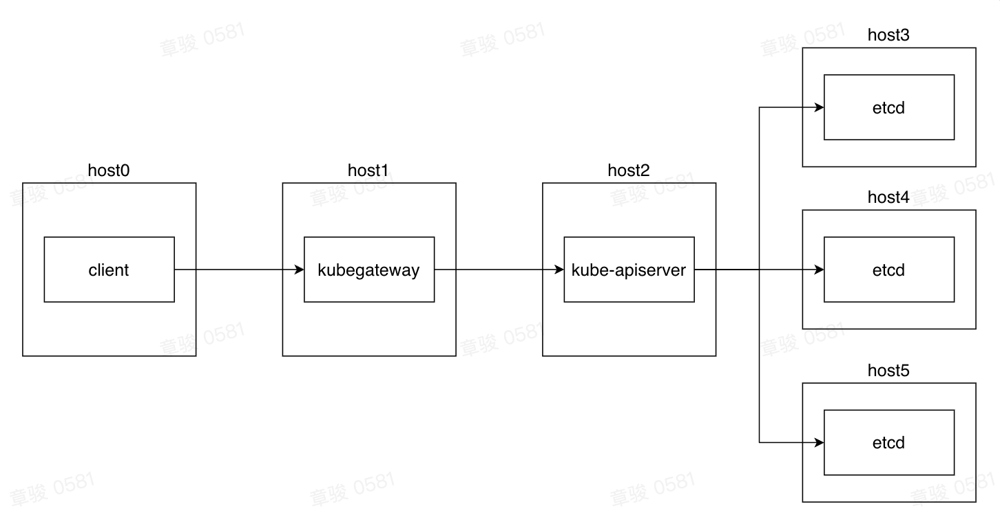

# KubeGateway 性能测试

## 目标

- 测试 api 请求经过 KubeGateway 之后的到 APIServer 增加的延迟

## 非目标

- APIServer 的极限压力

- KubeGateway 的极限压力

## 测试准备

### 测试机型

APIServer 所在节点机型信息

- CPU: Intel(R) Xeon(R) Platinum 8260 CPU @ 2.40GHz
- Memory: 376 GB
- 磁盘: SSD 共 1 块，总容量 1863 GB
- 网卡: 25000Mb/s

KubeGateway 所在节点机型信息

- CPU: Intel(R) Xeon(R) Platinum 8260 CPU @ 2.40GHz
- Memory: 376 GB
- 磁盘: SSD 共 1 块，总容量 1863 GB
- 网卡: 25000Mb/s

### 部署方式

部署一个节点的 KubeGateway + 一个节点的 KubeAPIServer + 3 节点的 ETCD

### 额外说明

我们的目标是测试请求经过 KubeGateway 后增加的延迟，为了减少额外因素的干扰，我们尽可能把流量终止在 apiserver，即让请求全部命中 kube-apiserver 中的 cache。由于 kube-apiserver 对于 pod 有额外的处理（如 pod gc 会将不符合要求的 pod 进行删除），我们使用 configmap 作为请求数据。提前在 kube-apiserver 中创建测试所需的 configmaps 用例，然后开始测试

下面的测试数据中，以 Get 的结果为准，Create 的数据中由于有 etcd 处理延迟的干扰，仅供参考。

另外由于 KubeGateway 中对于 token 的认证方式需要产生额外的请求，所以测试中做了区分

## 测试数据

| TestCase: GET Configmap | Client QPS | Authentication Method | min   | mean        | P50     | P90      | P95       | P99       | max       | KubeGateway throughput | KubeAPIServer throughput |
| ----------------------- | ---------- | --------------------- | ----- | ----------- | ------- | -------- | --------- | --------- | --------- | ---------------------- | ------------------------ |
| KubeAPIServer           | 5000       | TLS                   | 74ns  | **1.517ms** | 1.121ms | 1.292ms  | 1.362ms   | 14.112ms  | 125.575ms | 0                      | 5000                     |
| KubeAPIServer           | 5000       | TLS                   | 925ns | **1.662ms** | 1.144ms | 1.311ms  | 1.382ms   | 20.328ms  | 140.032ms | 0                      | 4999                     |
| KubeAPIServer           | 5000       | TLS                   | 73ns  | **1.677ms** | 1.168ms | 1.334ms  | 1.401ms   | 17.406ms  | 144.379ms | 0                      | 4999                     |
| KubeAPIServer           | 5000       | TLS                   | 448ns | 1.579ms     | 1.105ms | 1.27ms   | 1.341ms   | 12.088ms  | 206.709ms | 0                      | 4999                     |
| KubeAPIServer           | 5000       | TLS                   | 170ns | 1.659ms     | 1.157ms | 1.321ms  | 1.391ms   | 14.116ms  | 206.099ms | 0                      | 4999                     |
| KubeGateway             | 5000       | TLS                   | 207ns | 2.445ms     | 1.659ms | 2.013ms  | 2.822ms   | 26.27ms   | 214.799ms | 5000                   | 5000                     |
| KubeGateway             | 5000       | TLS                   | 500ns | 3.021ms     | 1.65ms  | 2.008ms  | 2.971ms   | 33.045ms  | 676.782ms | 5000                   | 5000                     |
| KubeGateway             | 5000       | TLS                   | 84ns  | 2.353ms     | 1.649ms | 1.994ms  | 2.851ms   | 20.31ms   | 232.801ms | 5000                   | 5000                     |
| KubeGateway             | 5000       | Token (no cache)      | 361ns | 16.304ms    | 3.054ms | 16.571ms | 107.589ms | 262.313ms | 1.732s    | 4999                   | 10000                    |
| KubeGateway             | 5000       | Token (600s cache)    | 648ns | 2.528ms     | 1.574ms | 1.913ms  | 2.401ms   | 32.582ms  | 314.817ms | 4999                   | 4999                     |

| TestCase:Create Configmaps | Client QPS | min   | mean     | P50     | P90      | P95      | P99       | max       | KubeGateway throughput | KubeAPIServer throughput |
| -------------------------- | ---------- | ----- | -------- | ------- | -------- | -------- | --------- | --------- | ---------------------- | ------------------------ |
| kubeAPIServer              | 10000      | 514ns | 9.856ms  | 2.537ms | 22.38ms  | 57.267ms | 125.353ms | 520.691ms | 9999                   | 9999                     |
| kubeAPIServer              | 10000      | 575ns | 9.483ms  | 2.373ms | 18.086ms | 55.129ms | 126.363ms | 521.442ms | 9999                   | 9999                     |
| KubeGateway                | 10000      | 684ns | 11.945ms | 3.615ms | 21.796ms | 47.491ms | 150.707ms | 1.333s    | 9941                   | 9941                     |
| KubeGateway                | 10000      | 813ns | 9.786ms  | 3.557ms | 14.152ms | 37.787ms | 109.144ms | 1.075s    | 9993                   | 9993                     |
| KubeGateway                | 10000      | 436ns | 12.104ms | 3.717ms | 24.044ms | 56.261ms | 143.505ms | 1.173s    | 9984                   | 9984                     |

## 结论

1. 请求经过 KubeGateway 之后延迟增加主要由两方面组成
   1. KubeGateway 对请求的预处理，这部分增加在 1-200 ms，平均约 3-5ms
   2. KubeGateway 到 APIServer 的网络延迟，完全由网络情况决定
2. **KubeGateway 对请求延迟的增加并不明显**，影响小于**网络延迟**和**请求穿透到** **etcd** **之后增加的延迟**
3. 应该控制 APIServer 单节点的压力，防止它过载，从而保证稳定性
